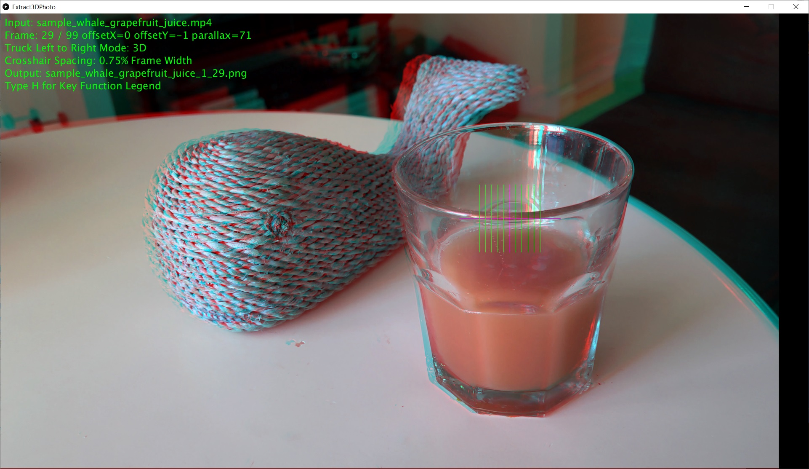

# Extract-3D-Photo-From-Video
This Java application written in the Processing language assists with manual left and right eye image pair extraction from motion videos that truck left to right. These extracted images form groups of 3D stereo photos, 4V quad stereo photos displayable on a Leia Lumpad glasses free 3D tablet display, and photo collections for creating 3D lenticular images. The motion videos capture static scences of stationary subjects for 3D viewing after image extraction.
 
Single key commands control the app operation to extract the left and right eye view photos. These commands are defined in help.txt. There is no graphical user interface at the moment.

Mouse press displays crosshairs that define a point in a movie frame scene for setting the stereo window. This point should be close to the foreground to reduce negative parallax (scene elements may pop out towards the viewer excessively) in the stereo photo. The cross hair line width helps the user to avoid 3D disparities that exceed 3% of the display width. 3D Images with disparities more than 3% are uncomfortable to view.

A stereo pair extracted from the video can be checked for good 3D viewing by a command that displays the 3D image in anaglyph. If more disparity is needed the right eye photo can be changed and viewed again. 

I found that extracting 4V images the disparity between each image should not exceed 1%, even better to have less disparity. This is the reason for default 0.75% spacing in the crosshair grid.

Currently the size of the extracted saved photos is the size of the display window the application runs on. A specified size(width, height) window or full screen can be defined in the application's settings() function.

So far I have experimented with mp4 video files with resolutions of 1920x1080, 3840x2160 (4K), and 7680x4320 (8K) pixels. The 8K video files are noticibly slow reads on my computer. The source of the videos are my Samsung phone and DSLR camera.

## Building the Application
When you compile and run the Extract 3D Photo application in the Processing SDK for Windows or Linux (version 3.5.4), you must add the SelectFile contributed library to the Processing SDK. See [Processing Library](https://processing.org/reference/libraries/) information under Contributions.

[SelectFile Library Documentation](https://andrusiv.com/android-select-file/)

## Screenshot

